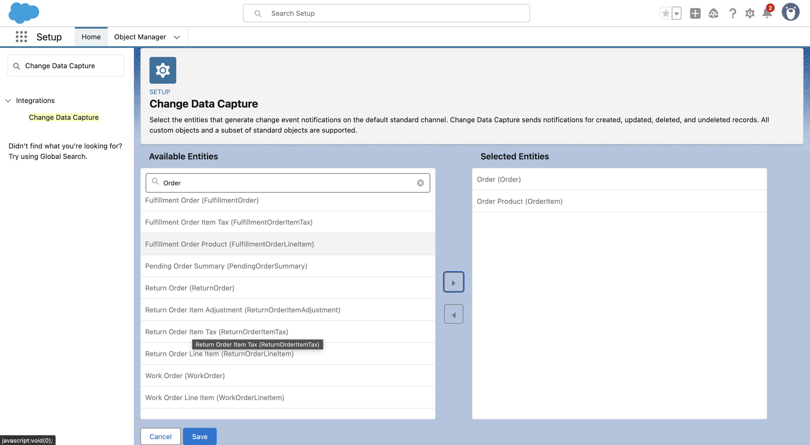

# Loyalty Experiment

## Introduction

A proof of concept of an loyalty backend wherein Salesforce Loyalty Management is the source of truth for the customers loyalty transactions, points, tier (e.t.c).

The purpose of this project is to:
- Evaluate NodeJS libraries for Salesforce vs. propietary solutions e.g. Mulesoft
- Demonstrate and Evaluate NodeJS libraries for building an Event Driven Architecture where Salesforce is the Event source
- Demonstrate that building loyalty functionality powered by Salesforce but outside of Salesforce (and Mulesoft) flows is more flexible to change, faster to develop, can be validated in PRs, can be tested end-to-end more thoroughly, loosely coupled to a particular SaaS and more conducive to a headless microservice architecture.

The Proof of Concept uses Salesforce Sales Cloud since it's free, but the intention would be to intgerate Salesforce Loyalty Management. To be more precise, I've used `Order`, `OrderItem` in `Salesforce Sales Cloud` in place of `TransactionJournal`, `Product`, `ProductLineItem` in Salesforce Loyalty.

**Note**: We're using Salesforce events to replicate the transaction history in a relational database store. The idea behind this is to own our own data (rather than rely on a SaaS product for storage). It might also reduce the number of queries to Salesforce resulting in an overall more cost-effective use of a their License. In practice, this could get a little hairy e.g. if events are missed or processed twice.

## Glossary

- **Loyalty Application**: A loyalty application is an application that allows you to take advantage of rewards earned from repeatedly using a service. A good example is Airline Frequent Flyer programmes that offer you benefits for repeatedly travelling with the airline.

- **Loyalty Partners**: A loyalty partner is a company that either expands or enhances the loyalty eco-system. 

    For example; a car rental companies could expand a frequent flyer programme so that you earn miles not only when you fly, but also when you rent a car and drive.

    hotels could enhance the frequent flyer programme by offering a discounted stay in exchange for redeeming miles.

    This project only considers partners that expand the ecosystem. In this respect, partner companies notify the loyalty backend when a transaction occurs so that the programme member earns loyalty currency.

---

## Migrations

### Create Migration File

```
npx knex migrate:make create_raffles_table 
```

## Keycloak

### Importing/Exporting realms

- The following commands were used to export the keycloak realms. These commands were run in the containers, with the output directory mounted to the host machine.

```shell
docker exec -it keycloak sh
cd ~/bin

./kc.sh export --realm loyalty --file /tmp/export/loyalty.json --db postgres --db-url jdbc:postgresql://authdb:5432/keycloak --db-username postgres --db-password password

./kc.sh export --realm master --file /tmp/export/master.json --db postgres --db-url jdbc:postgresql://authdb:5432/keycloak --db-username postgres --db-password password
```

- I think the master realm can't be imported. This means that `docker compose up -d` pretty much spins up everything ready to go, except that admin-cli needs to be configured for signing-up users. See [guide](./backend/docs/keycloak-setup.md#sign-up)

## Salesforce

Salesforce events are triggered through Change Data Capture. The setup is shown below:



---
## curl Requests

### Create Member

```shell
curl -X POST --json "$(jq -n \
  --arg fn "John" \
  --arg ln "Doe" \
  --arg pwd "12345678" \
  --arg mobile "971561234567" \
  --arg email "john$(date +%Y%m%d%H%M%S)@doe.com" \
  --arg birth "1970-01-01" \
  '{firstName: $fn, lastName: $ln, password: $pwd, mobileNumber: $mobile, email: $email, birthDate: $birth}')" \
http://localhost:3000/api/v1/user/register
```

### 
---

## To Do

- [x] 1. Receive Order Event
- [x] 2. SFDX
- [x] 3. Issue raffle tickets when a transaction is done. 
- [x] 4. Autorenew PubSub Subscription
- [x] 5. Use CDC instead of Platform Events
- [x] 6. Setup DB connectivity
- [x] 7. Validate request, model classes to make the code clearer? Should I migrate to TypeScript?
- [x] 8. Sort out out-of-order events.
- [x] 9. Sign-up as Member (Username/Password)
- [x] 10. Login as Member, View own Profile (but not other)
- [x] 11. Use client_credentials grant for Transaction API 
- [ ] 13. Sign-up and sign-in with Google.

## Useful Resource

- [Salesforce Pub/Sub](https://jungleeforce.com/2021/11/11/connecting-to-salesforce-using-pub-sub-api-grpc/)
- [ExpressJS Folder Structure](https://www.codemzy.com/blog/nodejs-file-folder-structure)
- [Express Validator](https://stackoverflow.com/a/70637527/821110). Another [example](https://stackoverflow.com/a/60592312/821110) using Joi
- [Express Openid](https://medium.com/keycloak/keycloak-express-openid-client-fabea857f11f)
- [Express & PassportJS](https://curity.io/resources/learn/oidc-node-express/)
- [Add Custom Claims to OpenID Token](https://medium.com/@ramanamuttana/custom-attribute-in-keycloak-access-token-831b4be7384a)
- [Add more info to userInfo endpoint](https://stackoverflow.com/questions/75869268/get-roles-from-keycloak-userinfo-endpoint)
- [OpenID Configuration](http://localhost:8080/realms/loyalty/.well-known/openid-configuration)
- [NodeJS Redis Cheatsheet](https://redis.js.org/#node-redis-usage-redis-commands)
