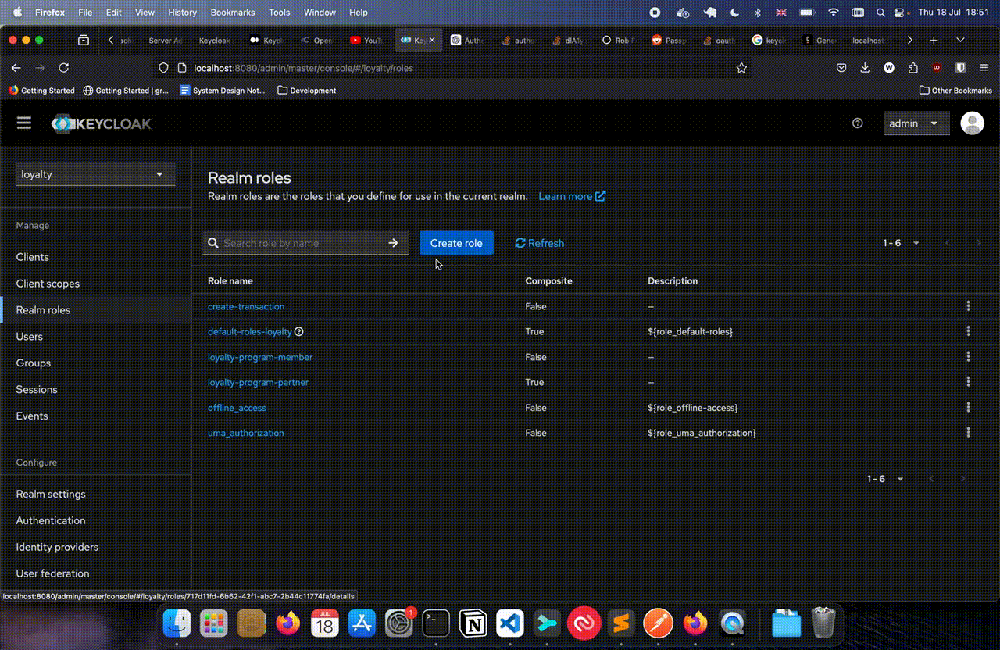
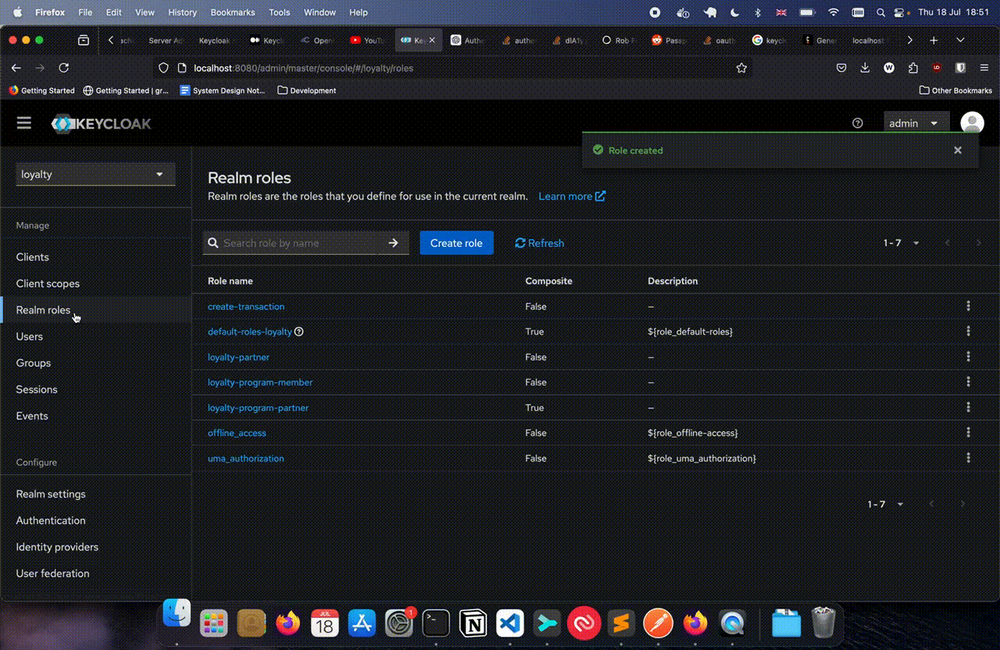

## Client Credentials with Keycloak

## Roles

- A `role` represents a set of priveleges e.g. `admin`, `user`, `third-party`.
- Roles can be created in a realm in the `Realm Roles` tab. These are roles that are applicable to the entire realm.

## Scope

- A `scope` is something that a role can do e.g. `view-account`.
- A scope can also be created in the `Realm Roles` tab. These are scopes that are applicable to the entire realm.

## Assigning scopes to roles

From what I understand
- A `role` (e.g. `admin`) can be made composite by containing other `roles` 
- So to assign scopes to a role, you create a role (e.g. `admin`) and then you add associated roles (e.g. `view-account`)

## Assigning a role to a client

- A role is assigned to a client if:
    1. It is added to the dedicated scope
        1. Select the Realm e.g. `loyalty`
        1. Select the Client e.g. `parnter-1`
        1. Select the `Client Scopes` Tab
        1. In the `Setup` tab, click on the `${client-name}-dedicated` e.g. `partner-1-dedicated`
        1. In the next screen, select `Scope`. 
        1. Click on `Assign role`, filter by realm roles (instead of filtering by clients) and then select the role to assign e.g. `loyalty-program-partner`
    2. If the role is assigned to the service account
        1. Select the Realm e.g. `loyalty`
        1. Select the Client e.g. `parnter-1`
        1. Select the `Service Account Roles` Tab
        1. Click on `Assign role`, filter by realm roles (instead of filtering by clients) and then select the role to assign e.g. `loyalty-program-partner`

## Display Realm Roles in the User Info Endpoint

- This project uses the userinfo endpoint to validate the OAuth2 client_credentials bearer token.
- After the validation is successful, the roles are extracted from the token so that they can be used to check if the client has the requisite scopes to perform the action it is trying to perform. 
- However, scopes (realm roles) are not returned by default in the userinfo endpoint response. This needs to be enabled using the steps below:

1. Select the Realm e.g. `loyalty`
1. Select the Client e.g. `parnter-1`
1. Select the `Client Scopes` Tab
1. In the `Setup` tab, click on the `${client-name}-dedicated` e.g. `partner-1-dedicated`
1. In the next screen, select `Mappers`. 
1. Click on `Add Mappers` and select `From predefined mappers` from the drop down. Search for realm roles and select it.
1. Once added, click on `realm roles` and in the resulting form, enable return in `user info endpoint`.

