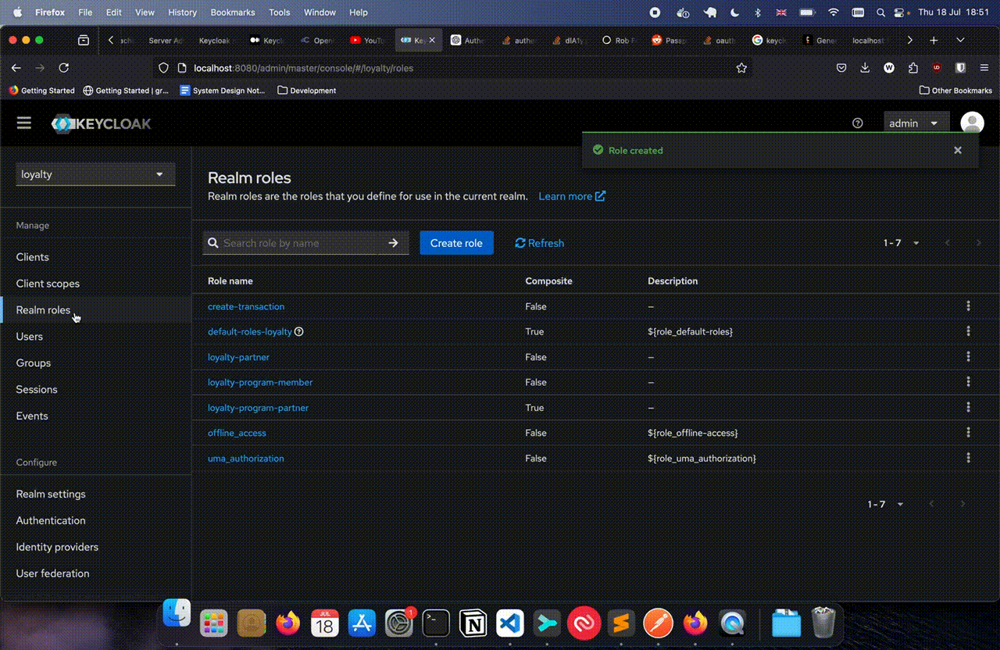

# Keycloak Setup
---

## Setup

### Clients

- A client is a service or application that requests keycloak to authenticate a user.
- In this project we have two clients: 

    - `loyalty-client`: which can be thought of as the client used in the front-end e.g. the frequent flyer programme mobile app.
    - `partner-1`: which represents a partner that expands the ecosystem e.g. a car rental company.

- A client is created in the `loyalty` realm by clicking on `Clients` and creating a new client.

- For `loyalty-client`, we do not enable Client Authentication as we are usign the Authorization Code with PKCE grant. This grant does not use a client secret.


- For `partner-1`, we enable Client Authentication and Authorization as we will be using the client_credentials flow. This flow is suitable for Machine-to-Machine tokens.


### Roles

- A `role` represents a set of priveleges e.g. `admin`, `user`, `third-party`.
- Roles can be created in a realm in the `Realm Roles` tab. These are roles that are applicable to the entire realm.


### Scope

- A `scope` is something that a role can do e.g. `view-account`.
- A scope can also be created in the `Realm Roles` tab. These are scopes that are applicable to the entire realm.




### Assigning scopes to roles

From what I understand
- A `role` (e.g. `admin`) can be made composite by containing other `roles` 
- So to assign scopes to a role, you create a role (e.g. `admin`) and then you add associated roles (e.g. `view-account`)


### Assigning a role to a client

- A role is assigned to a client if:
    1. It is added to the dedicated scope
        1. Select the Realm e.g. `loyalty`
        1. Select the Client e.g. `parnter-1`
        1. Select the `Client Scopes` Tab
        1. In the `Setup` tab, click on the `${client-name}-dedicated` e.g. `partner-1-dedicated`
        1. In the next screen, select `Scope`. 
        1. Click on `Assign role`, filter by realm roles (instead of filtering by clients) and then select the role to assign e.g. `loyalty-program-partner`
    2. If the role is assigned to the service account
        1. Select the Realm e.g. `loyalty`
        1. Select the Client e.g. `parnter-1`
        1. Select the `Service Account Roles` Tab
        1. Click on `Assign role`, filter by realm roles (instead of filtering by clients) and then select the role to assign e.g. `loyalty-program-partner`


---

## Sign-up

### Configuring admin-cli for user registration

1. Open Keycloak Admin Portal `http://localhost:8080`
1. Select the `master` realm.
1. Select `Clients`
1. Select the `admin-cli` client.
1. Enable `Client authentication` and `Authorization` (`Direct access grants` and `Service accounts roles` should be checked). Save
1. The `Credentials` tab should now be visible. Click on the tab. Copy the client secret to the `.env` file.
1. Navigate to the `Service account roles` tab. Click on `Assign role`. Check:
    - `loyalty-realm`: `manage-users`
    - `loyalty-realm`: `manage-realm`


### Adding custom field to user profile

We want to add the salesforce contact Id in the user profile


### Including customerId in the Access Token

- We want to inlcude the customerId in the access token so that we can attribute actions and resources to the contact on Salesforce.


---
## Login

### Disabling sign-up on the login screen

A client will be able to request a token for a user from keycloak. 
The member will need to enter their login credentials in a keycloak login form.

We do not want to display the sign-up in the login form, because the sign-up needs to be integrated with Salesforce. 

To disable displaying sign-up in the login form:
1. Switch to the `loyalty` realm
2. Click on `Realm settings`
3. Click on the `Login` tab
4. Disable `User Registration`in the `Login screen customization` section


### Display Realm Roles in the User Info Endpoint

- This project uses the userinfo endpoint to validate the OAuth2 JWT bearer token.
- After the validation is successful, the roles are extracted from the token so that they can be used to check if the client has the requisite scopes to perform the action it is trying to perform. 
- However, scopes (realm roles) are not returned by default in the userinfo endpoint response. This needs to be enabled using the steps below:

1. Select the Realm e.g. `loyalty`
1. Select the Client e.g. `parnter-1`
1. Select the `Client Scopes` Tab
1. In the `Setup` tab, click on the `${client-name}-dedicated` e.g. `partner-1-dedicated`
1. In the next screen, select `Mappers`. 
1. Click on `Add Mappers` and select `From predefined mappers` from the drop down. Search for realm roles and select it.
1. Once added, click on `realm roles` and in the resulting form, enable return in `user info endpoint`.


## Samples

### Sample JWT payload

```json
{
  "exp": 1751916702,
  "iat": 1751916402,
  "jti": "235fcdfa-35d2-4426-93cb-56a56da52ec2",
  "iss": "http://localhost:8080/realms/loyalty",
  "aud": "account",
  "sub": "8b6a99f5-ae78-4be6-9a0e-ef53cc414083",
  "typ": "Bearer",
  "azp": "loyalty-client",
  "sid": "55648008-11fc-4122-868a-d95171a15da4",
  "acr": "1",
  "allowed-origins": [
    "http://localhost:3000"
  ],
  "realm_access": {
    "roles": [
      "offline_access",
      "loyalty-member",
      "default-roles-loyalty",
      "uma_authorization",
      "view-profile"
    ]
  },
  "resource_access": {
    "account": {
      "roles": [
        "manage-account",
        "manage-account-links",
        "view-profile"
      ]
    }
  },
  "scope": "profile email",
  "email_verified": true,
  "name": "John Doe",
  "customerId": "003gL00000721XAQAY",
  "preferred_username": "john20250707190156@doe.com",
  "given_name": "John",
  "family_name": "Doe",
  "email": "john20250707190156@doe.com"
}
```